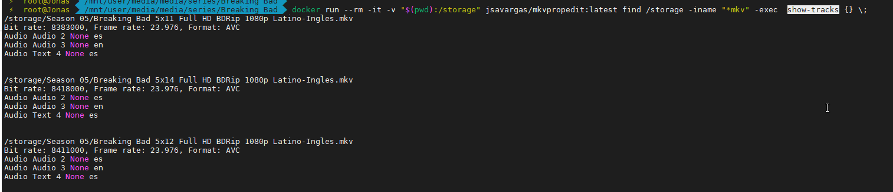

# Mkvpropedit

mkvdelspammkvdelspam es un script creado en python por y para el grupo Lat-Team, para la eliminacion del SPAM dentro de las pistas de video/audio/text en los mkv

## Usando Docker 

### mkvdelspam 

Nos movemos hasta la ruta donde estan los archivos a limpiar y ejecutamos el docker con la instruccion "find ." para que busque todos los archivos y elimine el spam de cada uno de ellosdocker run --rm -it -v "$(pwd):/storage" jsavargas/mkvpropedit:latest find /storage -iname "\*mkv" -exec mkvdelspam {} ;

<figure><figcaption></figcaption></figure>

### show-tracks 

​docker run --rm -it -v "$(pwd):/storage" jsavargas/mkvpropedit:latest find /storage -iname "\*mkv" -exec show-tracks {} ;

<figure><figcaption></figcaption></figure>
